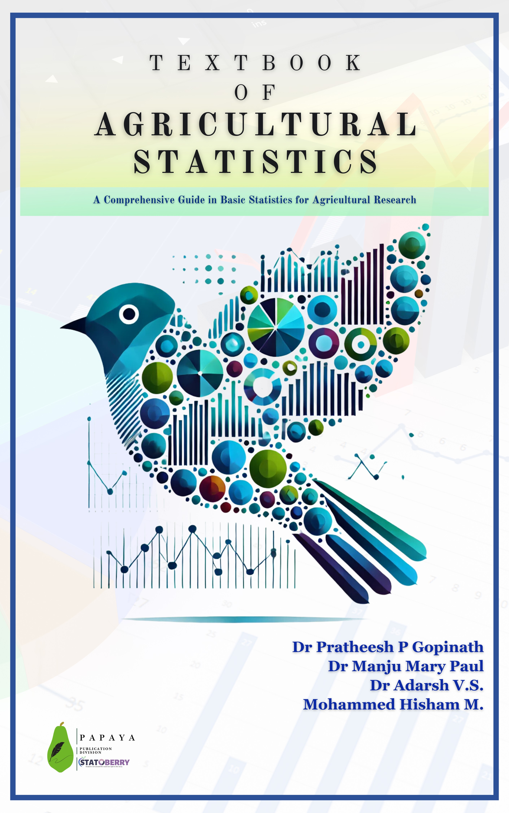

## 📚 Published Books {.unnumbered}

<a class="book-item" href="agstat-textbook.html" target="_blank" rel="noopener noreferrer">
  
  
Textbook of Agricultural Statistics

  
Suitable for STAT 3202

</a>

